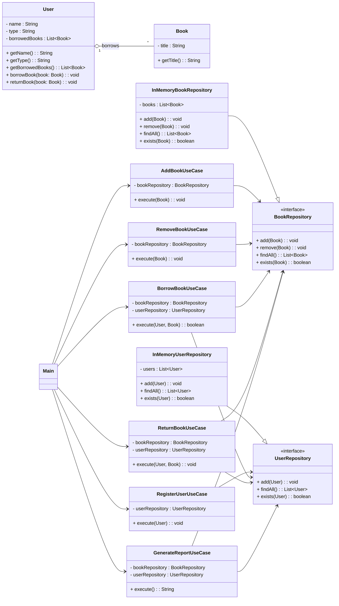
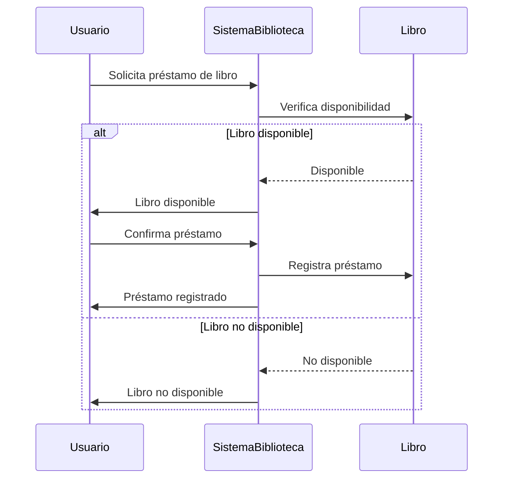
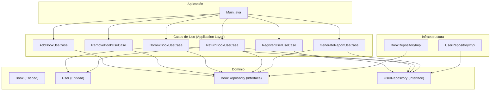

# Instrucciones para la actividad

## 🔧 Reestructuración del Proyecto: Ejercicio de Arquitectura Modular

Este proyecto de biblioteca fue desarrollado inicialmente sin una arquitectura modular clara. 
Como parte del curso, el objetivo de esta actividad es **proponer una nueva arquitectura interna del sistema**.

**modularizando el monolito**, sin necesidad de migrarse a microservicios u otros enfoques más complejos.

## 🎯 Objetivo

Rediseñar la estructura del sistema para que sea más clara, escalable y fácil de mantener, 
usando un monolito con una arquitectura modular.

### 🧠 Lógica actual del sistema

- **Estudiantes** pueden tomar prestados hasta **3 libros** simultáneamente.
- **Profesores** pueden tomar hasta **5 libros**.
- La clase `Library` administra los préstamos y verifica si el usuario aún puede tomar otro libro.
- No hay una separación clara de responsabilidades (por ejemplo, las reglas de préstamo están embebidas en la lógica general).
- Tampoco hay una estructura modular del sistema que permita escalarlo fácilmente o mantenerlo en el tiempo.

Este proyecto fue construido sin aplicar principios de arquitectura, y servirá como punto de partida para repensar su diseño organizacional.

---

## 📐 Formas de entrega según tu perfil

Hay **dos formas de entregar esta actividad**, dependiendo de tu nivel de familiaridad con la programación:

### 👨‍💻 Si eres un programador activo o manejas Java

Puedes realizar la entrega directamente como código:

- Refactoriza el proyecto original aplicando una estructura modular clara.
- Organiza tu Pull Request (PR) incluyendo la nueva estructura de carpetas y clases.
- Acompaña el PR con un resumen breve de tu propuesta de arquitectura en el `README.md`.

### ✍️ Si no eres programador activo o Java no es tu lenguaje principal

Puedes entregar tu propuesta en formato visual:

- Un diagrama que represente la estructura de carpetas que propones.
- Un diagrama de clases conceptual que muestre cómo modularizarías las entidades y responsabilidades.
- Puedes usar herramientas como [draw.io](https://app.diagrams.net/), Lucidchart, Figma, o incluso una imagen dibujada a mano clara.

## 📬 Entrega

- Si vas a hacer una **entrega con código Java**, organiza tu PR con la estructura propuesta y asegúrate de explicar brevemente tu diseño en el `README.md`.
- Si vas a entregar diagramas, **envíalos al correo**:

  **📧** mail@joelibaceta.com  
  **📝 Asunto:** `Arquitectura de Software G3 - Nombre y Apellido - Evaluacion 1`

## ✅ ¿Qué se evaluará?

- Claridad en la separación de responsabilidades.
- Lógica de modularización adecuada (no todo junto en un solo paquete).
- Coherencia en el uso de capas o módulos
- Entregables completos y bien justificados (diagrama y/o código).
- Presentación ordenada y profesional.

# Resolucion del Problema Planteado
## Alumno: Carlos Eduardo Cóndor Callupe
## Curso: Bootcamp de Arquitectura de Software
## Refactor: Estructura Modular en Java

Se reorganizó el proyecto aplicando una estructura modular con clean architecture:

- `/domain/model`: Entidades del sistema. Representan los conceptos del dominio como Book y User. Estas clases solo contienen lógica propia del objeto (por ejemplo, métodos para pedir o devolver un libro).
- `/domain/repository`: Interfaces que definen los contratos para acceder a los datos (por ejemplo, BookRepository, UserRepository). No contienen implementación.
- `/usecase`: Lógica de aplicación. Cada clase implementa un caso de uso concreto del sistema como agregar un libro, registrar un usuario o generar un reporte (AddBookUseCase, RegisterUserUseCase, etc.).
- `/infrastructure/repository`: Implementaciones concretas de los repositorios definidos en domain/repository. Por ejemplo, InMemoryBookRepository almacena los datos en memoria.
- `/app`:unto de entrada de la aplicación. La clase Main.java se encarga de armar los casos de uso y orquestar el flujo principal del programa.

Esto permite mayor claridad, separación de responsabilidades y facilita futuras ampliaciones.

## Diagrama de clases de la App Library

## Diagrama de Secuencia Prestar Libro

## Diagrama de Componentes

